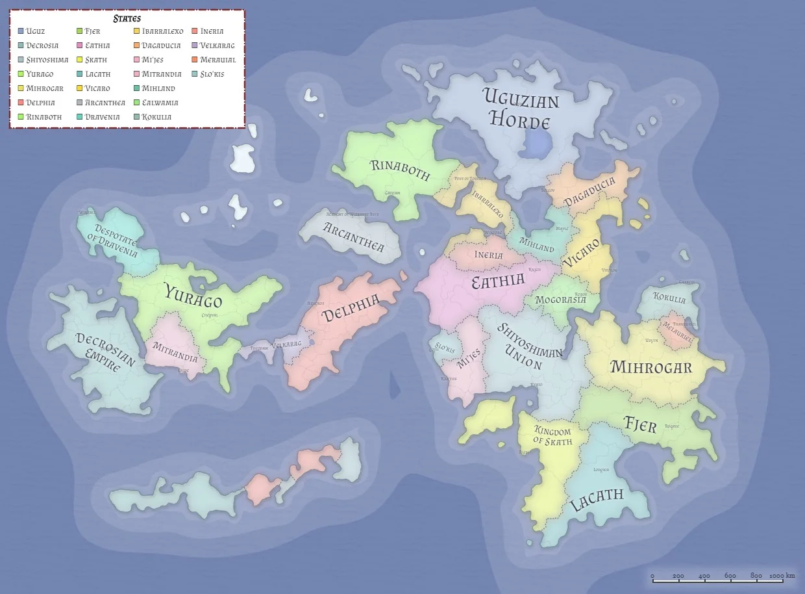

# Rinaboth - Sealing the Gates

This document describes the official web portal of the "Rinaboth" project. The application serves as a central information architecture that presents the protagonists, history, and geography of a fictional world.

## Project Context and Goals

The project was created as part of a frontend web development training program at the Digital Career Institute (DCI). The technical focus is on implementing responsive design concepts (mobile-first approach) and following digital accessibility guidelines (Accessibility/A11y).

## Technical Specifications and Features

**Markup language:** Valid, semantic HTML5 to ensure a machine-readable document structure.

**Design and layout:** Tailwind CSS (v4.x) and DaisyUI for adaptive, modern user interfaces.

**Accessibility (A11y):** Strategic use of aria attributes and touch-optimized interaction areas for mobile devices.

**Build tooling:** Vite as build tool and local development server.

## Future Development Phases

To transform the static information page into an interactive web application, the following functional enhancements are planned:

- [ ] **JavaScript integration:** Move data structures into JSON formats for dynamic content generation (DRY principle).
- [ ] **Extended accessibility:** Implement visible focus indicators to ensure standards-compliant keyboard navigation.
- [ ] **Interactivity:** Add filtering and sorting algorithms to manipulate content presentation.
- [ ] **Contrast audit:** Review and optimize color contrast according to Web Content Accessibility Guidelines (WCAG).

## Installation Guide

A working Node.js environment is required for local execution.

**1. Clone the repository**

```bash
git clone https://github.com/josephinemundt1297/d-and-d-project.git
```

**2. Change into the project directory**

```bash
cd d-and-d-project
```

**3. Install dependencies**

```bash
npm install
```

**4. Start the development server**

```bash
npm run dev
```

## Contributors

**Content concept (game master):** SL Voltikun (via World Anvil)

**Technical implementation and design:** Josephine Mundt, supported by Ndimofor Aretas (DCI mentor) and Gemini

---
