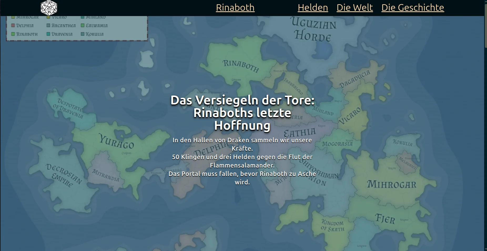

# 🛡️ Rinaboth – Das Versiegeln der Tore

Dieses Dokument beschreibt das offizielle Web-Portal des Projekts "Rinaboth". Die Anwendung fungiert als zentrale Informationsarchitektur zur Darstellung der Protagonisten, der Historie sowie der Geografie einer fiktiven Welt.

## 🎯 Projektkontext und Zielsetzung

Das Projekt wurde im Rahmen einer Qualifizierungsmaßnahme zur Frontend-Webentwicklerin am Digital Career Institute (DCI) realisiert. Der entwicklungstechnische Fokus liegt auf der Implementierung responsiver Designkonzepte (Mobile-First-Ansatz) sowie der Einhaltung von Richtlinien zur digitalen Barrierefreiheit (Accessibility/A11y).

## ⚙️ Technische Spezifikationen und Merkmale

**Struktursprache:** Valides, semantisches HTML5 zur Gewährleistung einer maschinenlesbaren Dokumentenstruktur.

**Design & Layout:** Tailwind CSS (v4.x) und DaisyUI für die Umsetzung adaptiver, moderner Benutzeroberflächen.

**Barrierefreiheit (A11y):** Strategische Integration von aria-Attributen sowie touch-optimierte Interaktionsflächen für mobile Endgeräte.

**Build-Management:** Vite als Build-Tool und lokaler Entwicklungsserver.

**🚀 Zukünftige Entwicklungsphasen**

Zur Transformation der statischen Informationsseite in eine interaktive Web-Applikation sind folgende funktionale Erweiterungen geplant:

[ ] **JavaScript-Integration:** Extraktion von Datenstrukturen in JSON-Formate zur dynamischen Inhaltsgenerierung (DRY-Prinzip).

[ ] **Erweiterte Barrierefreiheit:** Implementierung visueller Fokus-Indikatoren zur Gewährleistung einer normgerechten Tastaturnavigation.

[ ] **Interaktivität:** Integration von Filter- und Sortieralgorithmen zur Manipulation der Inhaltsdarstellung.

[ ] **Kontrast-Audit:** Überprüfung und Optimierung der Farbkontraste in Übereinstimmung mit den Vorgaben der Web Content Accessibility Guidelines (WCAG).

## 💻 Installationsanleitung

Für die lokale Ausführung wird eine funktionale Node.js-Umgebung vorausgesetzt.

**1. Repository klonen**

```
git clone [https://github.com/josephinemundt1297/d-and-d-project.git](https://github.com/josephinemundt1297/d-and-d-project.git)
```

**2. In das Verzeichnis wechseln**

```
cd d-and-d-project
```

**3. Abhängigkeiten installieren**

```
npm install
```

**4. Entwicklungsserver starten**

```
npm run dev
```

**👥 Projektbeteiligte**

Inhaltliche Konzeption (Spielleitung): SL Voltikun (via World Anvil)

Technische Umsetzung und Design: Josephine Mundt, unterstützt durch Ndimofor Aretas (DCI Mentor) und Gemini

---
